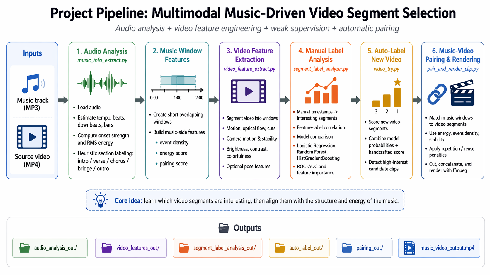
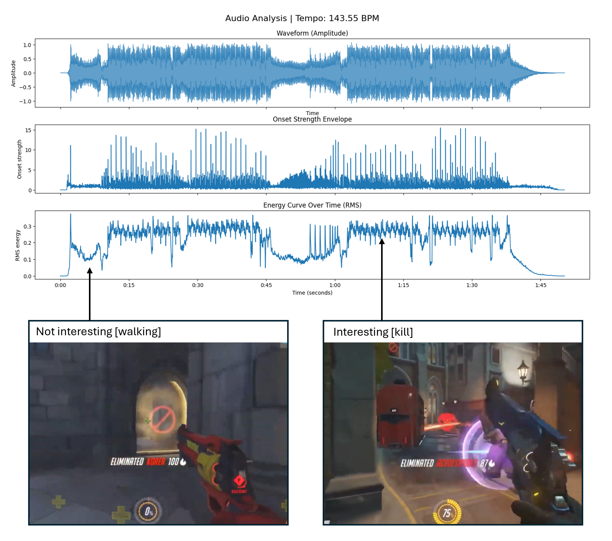
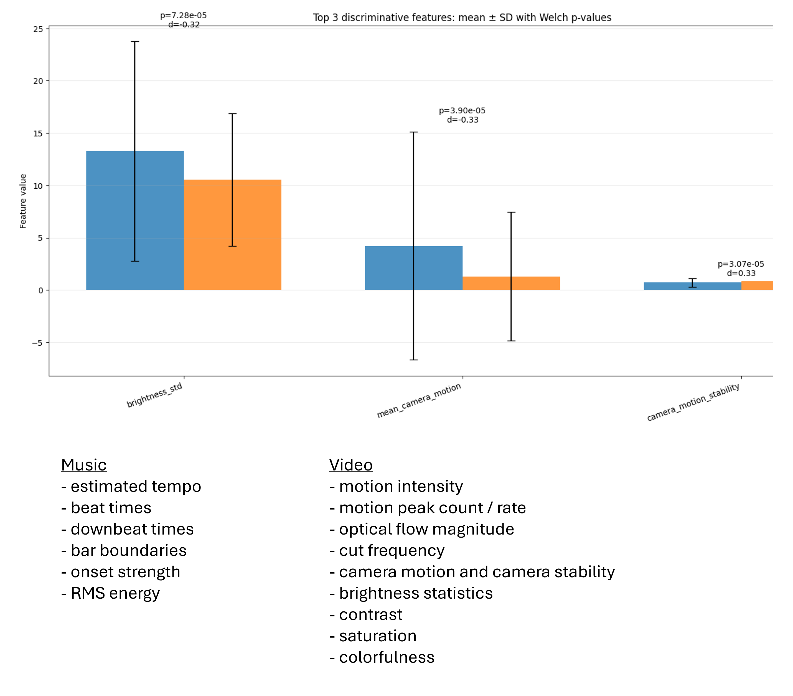
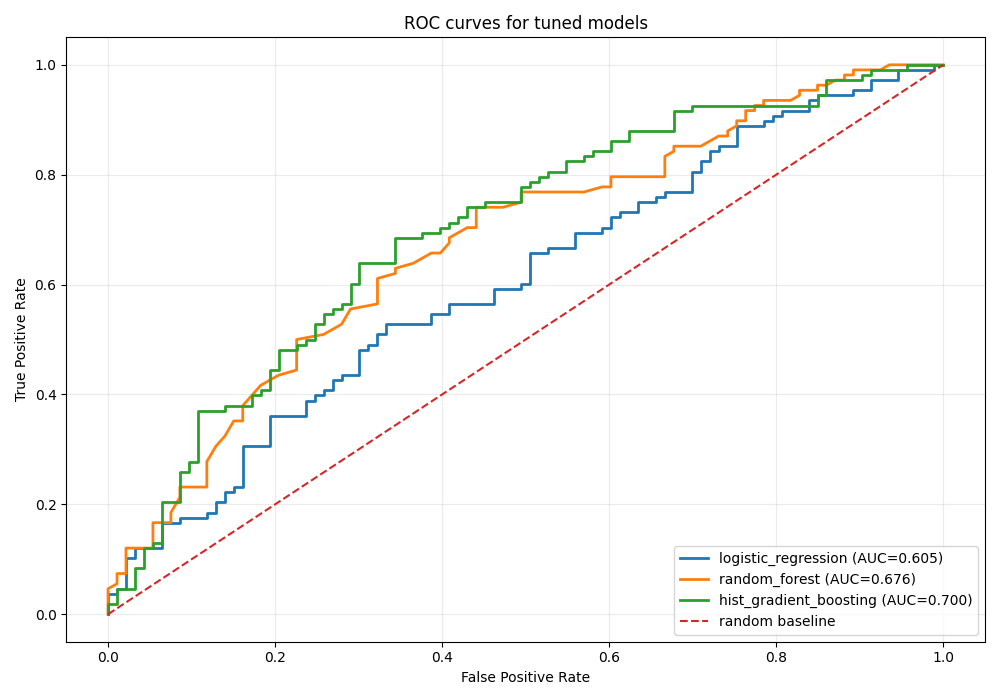

# Multimodal Music-Driven Video Segment Selection

A multimodal pipeline for analyzing music and video, identifying high-interest video segments, and supporting music-aligned highlight creation.

## Overview

This project explores how audio structure and video dynamics can be combined to find visually interesting segments and align them with the rhythm, energy, and structure of a music track. The workflow combines audio analysis, video feature extraction, weak supervision from manual labels, model-based auto-labeling, and downstream pairing for clip generation.

The current codebase includes scripts for:
- audio-side analysis and music feature extraction
- video feature extraction from short segments
- manual label analysis and feature-based model evaluation
- automatic scoring of segments in a new video

## Repository Title

**Multimodal Music-Driven Video Segment Selection**

## Short Description

**A multimodal pipeline that analyzes music and video features to detect interesting video segments and support music-aligned highlight generation.**

## Included Visual Results

### 1. Pipeline overview


### 2. Audio analysis example


### 4. Example discriminative features


### 4. ROC curves for tuned models


## Main Scripts

### `music_info_extract.py`
Extracts music-side information such as tempo, beats, downbeats, bars, onset strength, and RMS energy, and supports music-window level feature construction.

### `video_feature_extract.py`
Extracts segment-level visual features from video clips, including motion intensity, optical flow, cut frequency, camera motion, brightness statistics, contrast, saturation, and colorfulness.

### `segment_label_analyzer.py`
Builds weak labels from manually selected timestamps, compares feature-label relationships, evaluates multiple classifiers, and analyzes the most discriminative features.

### `video_try.py`
Applies trained models and handcrafted scoring logic to a new video, ranks candidate segments, and prepares auto-labeled outputs for downstream selection.


```

## Example Use Case

A typical workflow looks like this:

1. Analyze a music track to estimate tempo, beats, downbeats, bars, onset strength, and RMS energy.
2. Segment a source video into short overlapping windows.
3. Extract video-side motion, flow, cut, camera, and appearance features.
4. Use manually marked interesting timestamps to create weak labels.
5. Train and compare models that distinguish interesting vs. non-interesting segments.
6. Score segments from a new video and select the best candidates for music-driven editing.

## Future Extensions

Potential next steps include:
- tighter music-video alignment using beat- or bar-synchronous matching
- stronger supervision with richer annotations
- rendering and clip assembly automation
- semantic scene understanding for more content-aware pairing
- end-to-end ranking models for highlight generation


